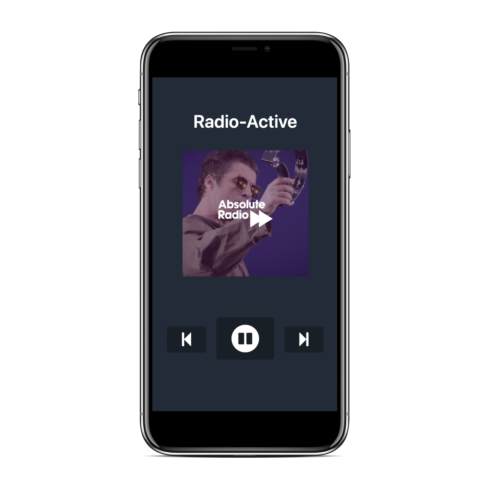

[](https://github.com/jasylwong/radio-active/actions) 

# Radio-Active 📻 ☢️

Live link [here](https://jasylwong.github.io/radio-active/)!

[Objective](#Objective) | [Technologies used](#tech) | [Running the program](#running_the_program) | [Further work](#further_work)



## <a name="Objective">Objective</a>

I love music. I love tech. I combined the two.
A React app which plays some radio stations I like.

This app uses GitHub Actions and Pages for CI/CD, and only on valid new branch pull requests.

Added bonus: no messages asking for cookie consent, and autoplay auto enabled. Therefore you can start listening to music instantly just by going to my website, as opposed to the official website where it takes multiple clicks and some time before you can start streaming the radio.


## <a name="tech">Technologies used</a>

- Frontend: React
- API: Absolute Radio
- CI & CD: GitHub Actions & GitHub Pages
- Linter: ESLint
- Styling frameworks: Water.css
- Test framework: Jest and Enzyme

## <a name="running_the_program">Running the program</a>

### Setup
```
$ git clone https://github.com/jasylwong/radio-active.git
$ cd radio-active
$ npm i
$ npm start
```

### Testing and code style
```
$ npm run test
$ eslint .
```

## <a name="Further work">Further work</a>

Further features that I would like to add:
- Display artist and name of song currently playing
- Add a volume slider and a mute button
